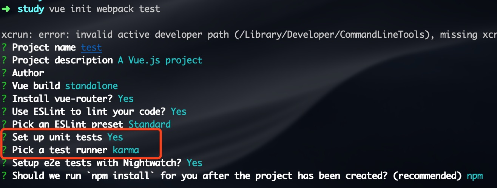
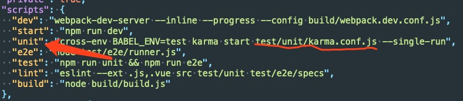

### 使用 vue-cli 快速搭建自动化测试环境
---

* 初始化项目, 引入测试模组


* 追寻测试运行逻辑及文件
  * package.json
  
  * karma.config.js
    ```
    var webpackConfig = require('../../build/webpack.test.conf')

    module.exports = function karmaConfig (config) {
      config.set({
        // PhantomJS - scriptable headless browser
        browsers: ['PhantomJS'],
        frameworks: ['mocha', 'sinon-chai', 'phantomjs-shim'],
        // 导出内容
        reporters: ['spec', 'coverage'],
        // 测试文件
        files: ['./index.js'],
        // 预处理
        preprocessors: {
          './index.js': ['webpack', 'sourcemap']
        },
        // webpack
        webpack: webpackConfig,
        webpackMiddleware: {
          noInfo: true
        },
        // 覆盖率报告文件设置
        coverageReporter: {
          dir: './coverage',
          reporters: [
            { type: 'lcov', subdir: '.' },
            { type: 'text-summary' }
          ]
        }
      })
    }
    ```
    * 测试文件集合 index.js
    ```
    import Vue from 'vue'

    // Vue.config 包含 Vue 的全局配置
    // productionTip: 组织 vue 在启动时生成生产信息 
    Vue.config.productionTip = false

    // require.context (https://github.com/wilsonlewis/require-context)
    const testsContext = require.context('./specs', true, /\.spec$/)
    testsContext.keys().forEach(testsContext)

    // require all src files except main.js for coverage.
    // you can also change this to match only the subset of files that
    // you want coverage for.
    const srcContext = require.context('../../src', true, /^\.\/(?!main(\.js)?$)/)
    srcContext.keys().forEach(srcContext)
    ```
    * 测试文件
    ```
    import Vue from 'vue'
    import HelloWorld from '@/components/HelloWorld'

    describe('HelloWorld.vue', () => {
      it('should render correct contents', () => {
        // https://cn.vuejs.org/v2/api/#Vue-extend
        const Constructor = Vue.extend(HelloWorld)
        const vm = new Constructor().$mount()
        expect(vm.$el.querySelector('.hello h1').textContent)
          .to.equal('Welcome to Your Vue.js App')
      })
    })
    ```
